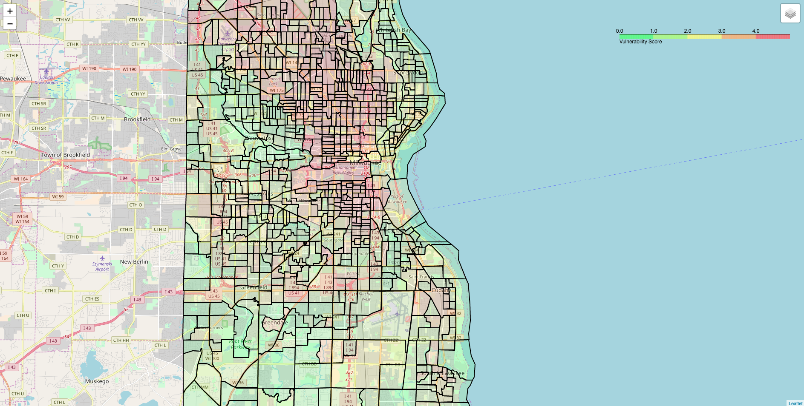

## Trying to Anticipate Gentrification

This repository implements a brief version of the genetrification vulnerability methodology developed by researchers at Porltand State University (PSU) in 2013. 

(see appendix A)
<http://pdxscholar.library.pdx.edu/cgi/viewcontent.cgi?article=1082&context=usp_fac> 

With gentrification a growing problem in Portland and other urban areas around the country, the researchers were hoping to identify areas of the city that might be vulnerable to future gentrification. 

This analysis is conducted with data from the 5-Year American Community Survey (ACS) estimates at the block group level from 2012 - 2015 for Milwaukee County, Wisconsin. The data is accessed via the census api and manipulated with pandas. Geopandas and Folium are used for spatial work and interactive mapping. The basic block group geometries were obtained from the Census Tiger files.

<https://www.census.gov/data/developers/data-sets/acs-5year.2015.html>

<https://pandas.pydata.org/pandas-docs/stable/>

<http://geopandas.org/>

<https://github.com/python-visualization/folium>

<https://www.census.gov/geo/maps-data/data/tiger-line.html>

Researchers identified four risk factors that have been historically associated with areas that gentrify: lack of educational attainment, communities of color, lack of home ownership (tenure) and lower incomes.

* Education: If the percentage of the population, 25 or older with a bachelors degree or higher, is less than county-level percentage, that block group is marked 1. Otherwise, it is marked 0.

* Communities of color: If the percentage of the population that is white alone is less the county-level percentage (that is to say, the minority population is higher), that block group is marked 1. Otherwise, it is marked 0.

* Tenure: If the percentage of owner-occupied housing units is less than the county-level percentage (that is to say, more households are renters), that block group is marked 1. Otherwise, it is marked 0. 

* Income: If the percentage of a block group's households that are at or below 80% of count-level median household income is greater than 40% (equivalent to 80% MHI at the county-level) it is marked a 1. Otherwise, it is marked 0.

These risk factors are added to form the total vulnerability score with 0 being low vulnerability and 4 being high vulnerability.

At the end, we get an interactive  html map that can zoom and toggle layer data. Download mke_vulnerability.html from this repository to explore as github cannot render large html files.
